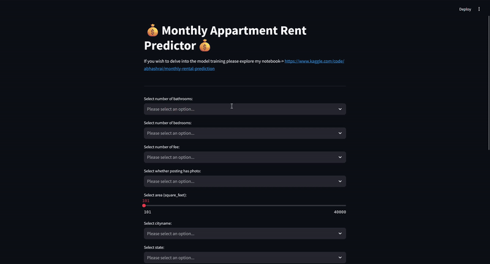

# US Monthly Appartment Price Prediction

This project is build using Streamlit for deployment of a trained CatBoost Regressor model developed to predict monthly appartment rent price prediction. The model used here achieved R2 score of 0.8101979279626192 on test dataset. For more details on the model training process, please visit the Kaggle project [here](https://www.kaggle.com/code/abhashrai/monthly-rental-prediction) or find the .ipynb file [here](./model-training/monthly-rental.ipynb).

<p align="center">
  
</p>

# Prerequisites

- You must have `Python 3` installed on your system.
- You must have `Git` installed on your system.

# Installation

1. Clone the repository `(In terminal)`:

    ```
    git clone https://github.com/abhash-rai/US-Monthly-Appartment-Price-Prediction.git
    ```

2. Enter into the streamlit app directory:

    ```
    cd US-Monthly-Appartment-Price-Prediction/model-deployed
    ```
    
3. (If on windows) Run the `run.bat` file:

    ```
    run.bat
    ```

    > First time running this will take some time as it will create a virtual environment, install dependencies and run streamlit app automatically.

4. (If on other system) You must first create a virtual environment, install dependencies from [requirements.txt](./model-deployed/requirements.txt) and run the streamlit app script named [main.py](./model-deployed/main.py)


